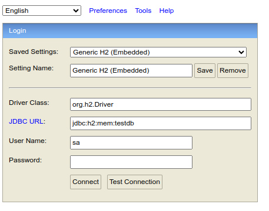
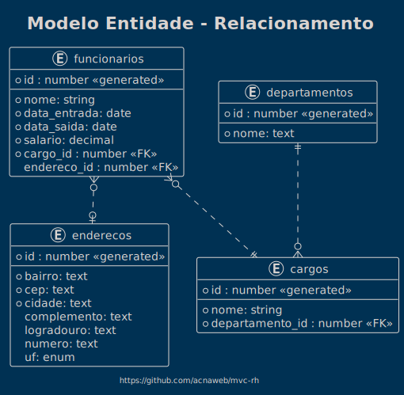
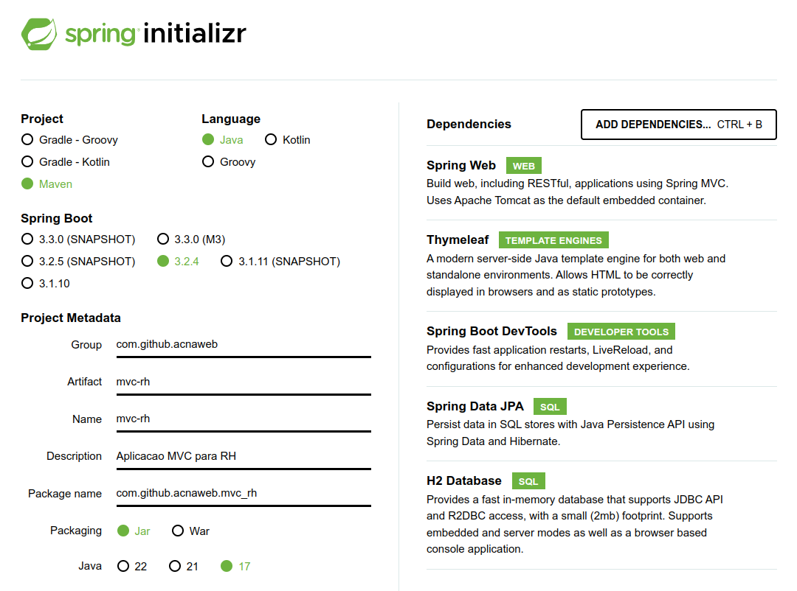

# MVC RH

Aplicação MVC de Recursos Humanos para fins didáticos

## Setup e Uso

### Execução / Local dev

#### Terminal

```sh
./mvnw spring-boot:run -Dspring-boot.run.profiles=dev
```

#### [H2 Web UI](http://localhost:8080/h2-console)

> - *url*: jdbc:h2:mem:testdb
> - *usuário*: sa
> - *senha*: password



## Arquitetura

### MER



## Java

> [Spring Initializr](https://start.spring.io/) - Criar aplicação conforme a configuração 

### Spring Boot - Configuração



## Referencias

 - https://spring.io/projects/spring-framework
 - https://plantuml.com/

## Comandos para usar no h2 para acionar a sequencia

insert into departamentos (id, nome) values (nextval('departamentos_seq'),'Vendas');

select * from departamentos;

Comando para subir uma imagem de um banco de dados no Docker (MySQL) docker run -d
-e MYSQL_ROOT_PASSWORD=root_pwd
-e MYSQL_USER=new_user
-e MYSQL_PASSWORD=my_pwd
-p 3306:3306
mysql